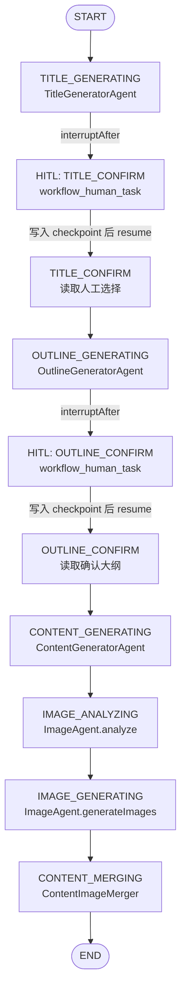
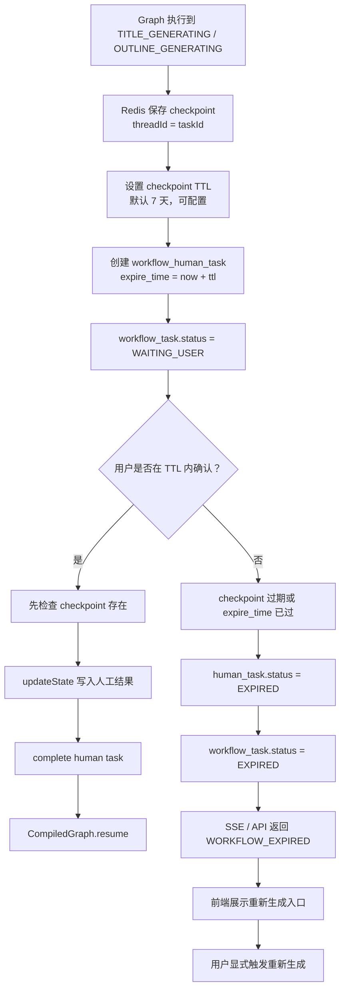

## Context

文章创作流程已经具备确定性的阶段：标题生成、标题确认、大纲生成、大纲确认、正文生成、配图分析、配图生成、图文合成。这里的人工交互不是通用审批流，而是文章业务中的正式步骤。

前一版设计把重点放在“通用 WorkflowEngine + WorkflowDefinition + Adapter”。这个假设不够稳：rednote 未来很可能有不同的节点、节奏、表单和成功标准。强行抽公共模板会让第一个版本复杂化，也会让 Spring AI Alibaba Workflow 退化成外围适配器。

本设计改为：文章先直接使用 Spring AI Alibaba `StateGraph`。可复用部分只保留任务状态、人工任务、事件和 SSE 兼容映射；业务流程本身不抽公共模板。

## Goals / Non-Goals

**Goals:**

- 用 Spring AI Alibaba `StateGraph` 编排文章节点，并由 `CompiledGraph` 执行。
- 用 `CompileConfig.interruptAfter(...)` 在标题生成、大纲生成后中断。
- 用 `RunnableConfig.threadId(taskId)` 和 checkpoint 恢复同一条 workflow 线程。
- 用 Redis 持久化 checkpoint，并为等待用户确认的 checkpoint 设置可配置过期时间，默认 7 天。
- 将标题确认、大纲确认建模为可落库、可校验、可重连恢复的 Human-in-the-Loop 任务。
- 保留 `rednote` 命名规范，但不实现 rednote workflow。

**Non-Goals:**

- 不建设通用 workflow 模板内核。
- 不实现动态 DAG、流程设计器、运行时拖拽编排。
- 不让 rednote 复用文章 workflow。
- 不重写现有标题、大纲、正文、配图 Agent。
- 不把文章业务结果迁移到 workflow JSON 作为主存储。

## Decisions

### Decision 1: 文章 workflow 直接定义 StateGraph



理由：

- `StateGraph` 是真实执行入口，不再存在“自定义引擎执行、Graph 工厂闲置”的问题。
- 文章节点直接实现 Spring AI Alibaba `NodeAction`，节点输入输出通过 `OverAllState` 传递。
- rednote 后续可定义自己的 `RednoteWorkflowGraphFactory`，避免被文章节点形状绑死。

### Decision 2: HITL 使用框架中断 + 业务人工任务

执行策略：

```text
CompiledGraph.invoke(input, RunnableConfig.threadId(taskId))
  -> TITLE_GENERATING 执行完成
  -> Spring AI Alibaba interruptAfter(TITLE_GENERATING)
  -> 后端创建 workflow_human_task(TITLE_CONFIRM)
  -> workflow_task.status = WAITING_USER
  -> 用户提交确认
  -> 校验 assignee/status/version/node
  -> CompiledGraph.updateState(threadId=taskId, humanResult)
  -> CompiledGraph.invoke(emptyMap, RunnableConfig.threadId(taskId).resume())
```

理由：

- Graph checkpoint 负责恢复执行位置和状态。
- `workflow_human_task` 负责业务层可见的人工任务、权限校验、SSE 重连补发。
- 这比在 controller 里硬编码“下一步调用哪个服务”更可测试，也比自建通用引擎更贴近 Spring AI Alibaba。

### Decision 3: 横向基础设施可以共用，但流程不共用

保留：

- `workflow_task`
- `workflow_human_task`
- `WorkflowContext`
- `WorkflowEventPublisher`
- `WorkflowHumanTaskService`

删除：

- `WorkflowEngine`
- `WorkflowDefinition`
- `WorkflowDefinitionRegistry`
- `WorkflowNode`
- `SpringAiAlibabaWorkflowGraphFactory`

理由：

- 任务、人工任务、事件是跨创作类型的基础设施。
- 流程定义和节点推进是业务特定逻辑，不应在第一版抽公共模板。

### Decision 4: 文章业务结果仍由文章表负责

`workflow_task.context_json` 只保存流程快照和节点传递状态。文章列表、详情、权限、统计仍以文章业务表为准。

理由：

- 查询和权限逻辑不应依赖大 JSON。
- Graph state 是编排状态，不是文章领域模型的替代品。

### Decision 5: rednote 只保留命名规范

持久化值：

```text
article
rednote
video_script
marketing_copy
```

枚举建议：

```text
ARTICLE("article")
REDNOTE("rednote")
VIDEO_SCRIPT("video_script")
MARKETING_COPY("marketing_copy")
```

rednote 后续应新增自己的 graph factory、节点 action、HITL 表单和 SSE 映射。

### Decision 6: Redis checkpoint 设置 TTL，过期后回到显式重新生成

当前 Spring AI Alibaba Graph 自带 `RedisSaver`，但本地源码显示其 `put()` 使用 `bucket.set(...)`，没有内建 TTL 参数。因此不能只把 `MemorySaver` 替换成 `RedisSaver` 就认为已经具备 7 天过期能力。

采用如下策略：



配置建议：

```yaml
creation:
  workflow:
    checkpoint-ttl: 7d
```

持久化状态建议：

```text
workflow_task
- status 增加 EXPIRED
- expire_time 可选，用于任务级过期判断和后台清理

workflow_human_task
- status 增加 EXPIRED
- expire_time 必填，用于确认接口和 SSE 重连判断
```

确认接口顺序必须调整：

```text
错误顺序：
completeHumanTask -> updateCheckpoint -> resume

正确顺序：
load waiting human task
check human task not expired
check checkpoint exists
update checkpoint state
complete human task
resume graph
```

理由：

- 如果先完成人工任务，再发现 checkpoint 已过期，会出现“人工任务已消费，但 workflow 无法恢复”的不一致。
- Redis TTL 是技术恢复窗口；`expire_time` 是业务可见窗口，两者必须使用同一个配置计算。
- 超过 7 天后不要自动重新生成，必须让用户显式触发，避免额外扣费、覆盖旧候选结果或造成不可解释的内容变化。

## Risks / Trade-offs

- [Risk] RedisSaver 默认没有 TTL。Mitigation: 封装 TTL-aware Redis checkpoint saver，或在每次 put 后对 checkpoint key、thread meta key、reverse key 统一设置过期时间。
- [Risk] Redis checkpoint 过期但数据库仍显示 WAITING_USER。Mitigation: human task 创建时写入 `expire_time`，确认和 SSE 重连都先检查过期并同步标记 EXPIRED。
- [Risk] Graph state 与 `workflow_task.context_json` 双写不一致。Mitigation: Graph lifecycle listener 每个节点后同步 context，并以文章业务表作为领域结果源。
- [Risk] 后续 rednote 也想复用基础设施。Mitigation: 复用任务、人工任务、事件即可，不复用文章 graph。

## Migration Plan

1. 增加 workflow 任务、人工任务、事件基础设施。
2. 新增 `ArticleWorkflowGraphFactory`，用 `StateGraph` 定义文章固定流程。
3. 将文章节点处理器改为 Spring AI Alibaba `NodeAction`。
4. 将 `ArticleWorkflowFacade` 改为创建任务、调用 `CompiledGraph`、处理中断和恢复。
5. 删除自定义 workflow 模板执行抽象。
6. 保留现有文章 API 和 SSE 兼容映射。
7. 将 checkpoint saver 替换为 Redis 持久化实现，并加入 7 天 TTL、过期状态和重新生成入口。
