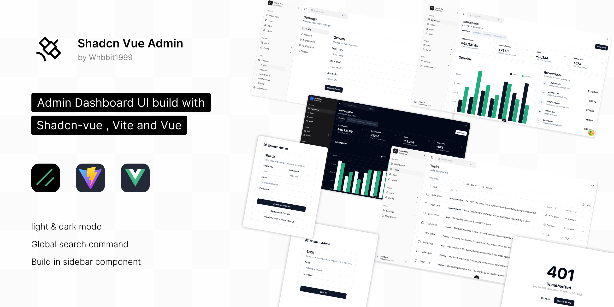

# Shadcn Vue Admin

[](https://github.com/antfu/eslint-config)
[](https://github.com/Whbbit1999/shadcn-vue-admin/blob/main/LICENSE)
[](https://vuejs.org/)
[](https://vitejs.dev/)
[](https://pnpm.io/)
[](https://www.typescriptlang.org/)

[简体中文](./README-CN.md) | English

A production-grade admin dashboard UI built with **Shadcn-vue**, **Vue 3.5+** and **Vite**, focusing on responsiveness, accessibility and developer experience.
Forked from [shadcn-admin](https://github.com/satnaing/shadcn-admin)



> ⚠️ Version Note: This is a starter template. New components and features will be continuously added to the project.

## ✨ Key Features

- ✅ Light/Dark mode toggle with Pinia persistent state
- ✅ Global search command palette
- ✅ Accessible shadcn-ui sidebar navigation
- ✅ 8+ pre-built functional pages
- ✅ Custom component library with shadcn-vue extensions
- ✅ Auto-generated routing system (based on file structure)
- ✅ Internationalization support (vue-i18n v11+)
- ✅ Form validation with VeeValidate + Zod
- ✅ Data visualization with TanStack Table/Query & Unovis
- ✅ Animation support (AutoAnimate, Motion-V, TW Animate CSS)

## 🛠️ Tech Stack & Version Constraints

| Category             | Tools & Libraries (Major Versions)                                                                                                                         |
| -------------------- | ---------------------------------------------------------------------------------------------------------------------------------------------------------- |
| Core Framework       | [Vue 3.5+](https://vuejs.org/), [TypeScript 5.9+](https://www.typescriptlang.org/)                                                                         |
| UI Components        | [shadcn-vue](https://www.shadcn-vue.com), [reka-ui 2+](https://www.reka-ui.com/), [@lucide/vue](https://lucide.dev/)                                       |
| Build Tool           | [Vite](https://vitejs.dev/), [@vitejs/plugin-vue 6+](https://github.com/vitejs/vite-plugin-vue)                                                            |
| State Management     | [Pinia 3+](https://pinia.vuejs.org/), [pinia-plugin-persistedstate 4+](https://prazdevs.github.io/pinia-plugin-persistedstate/)                            |
| Routing              | [vue-router 5+](https://router.vuejs.org/), [vite-plugin-vue-layouts 0.11+](https://github.com/JohnCampionJr/vite-plugin-vue-layouts)                      |
| Styling              | [Tailwind CSS 4+](https://tailwindcss.com/), [tailwindcss-animate 1+](https://github.com/jamiebuilds/tailwindcss-animate)                                  |
| Data Handling        | [TanStack Vue Query 5+](https://tanstack.com/query/latest), [TanStack Vue Table 8+](https://tanstack.com/table/latest)                                     |
| Form Validation      | [VeeValidate 4+](https://vee-validate.logaretm.com/), [Zod 4+](https://zod.dev/)                                                                           |
| Animation            | [@formkit/auto-animate 0.9+](https://auto-animate.formkit.com/), [motion-v 1+](https://motion-v.vercel.app/)                                               |
| Internationalization | [vue-i18n 11+](https://vue-i18n.intlify.dev/)                                                                                                              |
| HTTP Client          | [ofetch](https://github.com/unjs/ofetch)                                                                                                                   |
| Linting & Formatting | [ESLint 9+](https://eslint.org/), [@antfu/eslint-config 7+](https://github.com/antfu/eslint-config)                                                        |
| Dev Tools            | [vite-plugin-vue-devtools 8+](https://github.com/webfansplz/vite-plugin-vue-devtools)                                                                      |
| Auto Import          | [unplugin-auto-import 20+](https://github.com/antfu/unplugin-auto-import), [unplugin-vue-components 30+](https://github.com/antfu/unplugin-vue-components) |

## 🚀 Quick Start

### Prerequisites (Strict Version Requirements)

- Node.js ≥ 22.x (LTS recommended)
- **pnpm 10+** (Project-specified package manager)
- TypeScript ≥ 5.9.0

### Installation

1. Clone the repository

   ```bash
   git clone https://github.com/Whbbit1999/shadcn-vue-admin.git
   ```

2. Navigate to project directory

   ```bash
   cd shadcn-vue-admin
   ```

3. Install dependencies

   ```bash
   pnpm install
   ```

4. Start development server

   ```bash
   pnpm dev
   ```

### Available Scripts

```bash
pnpm dev             # Start development server
pnpm build           # Build for production (vue-tsc + vite build)
pnpm preview         # Preview production build
pnpm lint            # ESLint check
pnpm lint:fix        # Auto fix lint issues
pnpm release         # Bump version with bumpp
```

## 📖 Advanced Guides

### Dependency Maintenance

- All project dependencies are updated every Tuesday （UTC/GMT +8:00） to ensure security and compatibility.
- Version constraints are strictly managed (pinned versions for critical dependencies).
- Git hooks (pre-commit) are enabled via `simple-git-hooks` + `lint-staged` for code quality.

### Theme Customization

If you need to change the website style, you can use the preset styles provided by [tweakcn](https://tweakcn.com/editor/theme). You only need to copy the css variables provided by tweakcn to `index.css` and change the `:root` `:dark` and `@theme inline` parts.

### Layout Customization (No `index.vue` in nested directories)

For pages in `pages/errors/` and `pages/auth/` that you don’t want to use the default layout:

Create a same-name file in `pages/`:
`src/pages/errors.vue`
`src/pages/auth.vue`

```vue
<template>
  <router-view />
</template>

<route lang="yml">
meta:
  layout: false
</route>
```

This will generate extra empty routes like `/errors/` and `/auth/`.
To fix it, create `index.vue` inside the directory and add redirect:

```vue
<script lang="ts" setup>
const router = useRouter()
router.replace({ name: '/errors/404' })
</script>
```

## 📄 License

This project is licensed under the **MIT License** - see the [LICENSE](https://github.com/Whbbit1999/shadcn-vue-admin/blob/main/LICENSE) file for details.

## 🤝 Credits

- **Developer**: [Whbbit1999](https://github.com/Whbbit1999)
- **Original Design**: [shadcn-admin](https://github.com/satnaing/shadcn-admin)
